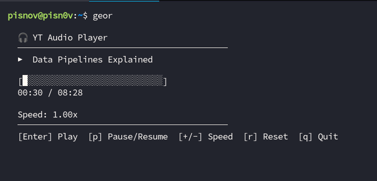

# geor: Terminal YouTube Audio Player

A terminal-based YouTube audio player written in Go. Features pitch-preserving speed control, a modern TUI, and robust streaming using yt-dlp and ffmpeg.
## Story

I love listening to podcasts on YouTube, but noticed that keeping just one YouTube tab open can use more than 500MB of memory. To solve this, I decided to develop my own lightweight terminal audio player that streams directly from YouTube. After building it for my own use, I wanted to share it as an open source project so others can benefit too.

## Features
- Play audio from YouTube URLs directly in your terminal
- Pitch-preserving speed change (0.5x–2.0x, via ffmpeg atempo)
- Clean TUI with progress bar, title, and controls (Bubbletea)
- Paste YouTube URLs (no extra brackets)
- Pause, resume, and seek support
- No debug output in terminal (logs to /tmp/yt-audio.log)

## Requirements
- Go 1.20+
- [yt-dlp](https://github.com/yt-dlp/yt-dlp) (auto-installed by the app)
- [ffmpeg](https://ffmpeg.org/) (must be in $PATH)

## Usage
1. Clone this repo:
   ```sh
   git clone https://github.com/pisnov/geor
   cd geor
   ```
2. Build and run:
   ```sh
   go run main.go
   ```
3. Paste a YouTube URL and press Enter to play.
   - Use `+` / `-` to change speed (pitch preserved)
   - Use Space to pause/resume
   - Press `q` to quit

## Architecture
- Uses [yt-dlp](https://github.com/yt-dlp/yt-dlp) to resolve direct audio stream URLs
- Streams audio via ffmpeg with `atempo` filter for pitch-preserving speed

- Decodes and plays audio using [beep](https://github.com/gopxl/beep)
- TUI built with [Bubbletea](https://github.com/charmbracelet/bubbletea)

## Screenshot

Below is a screenshot of the yt-audio terminal player in action:



## Credits
- [yt-dlp](https://github.com/yt-dlp/yt-dlp)
- [ffmpeg](https://ffmpeg.org/)
- [beep](https://github.com/gopxl/beep)
- [Bubbletea](https://github.com/charmbracelet/bubbletea)

## License
MIT
